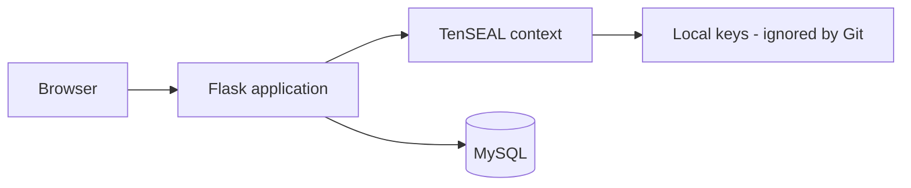

# Homomorphic Lending Demo

Simulacion educativa de prestamos P2P que usa cifrado homomorfico para operar
sobre determinados valores sin revelar el dato original durante el calculo. La
aplicacion combina Flask, MySQL y TenSEAL.

Este es un proyecto de investigacion y portafolio. No es un producto financiero
ni una implementacion criptografica auditada.

## Objetivo tecnico

- Generar y almacenar solicitudes de prestamo.
- Cifrar datos numericos con TenSEAL.
- Ejecutar operaciones admitidas sobre valores cifrados.
- Conservar historial crediticio y ofertas en MySQL.
- Separar las claves generadas del codigo fuente.

## Arquitectura



## Stack

- Python y Flask
- TenSEAL / Microsoft SEAL
- SQLAlchemy, Alembic y MySQL
- Docker Compose y Nginx
- Pruebas unitarias de operaciones cifradas

## Ejecucion con Docker

```bash
docker compose up --build
```

Para ejecucion manual:

```bash
python -m venv .venv
source .venv/bin/activate  # Windows: .venv\Scripts\activate
pip install -r requirements.txt
flask db upgrade
flask run
```

La carpeta `keys/` se genera localmente. Solo se conserva `.gitkeep`; nunca se
deben publicar claves reales.

## Pruebas

```bash
python -m unittest discover -s tests
```

## Limitaciones de seguridad

- El esquema, los parametros criptograficos y la gestion de claves no han sido
  auditados.
- El demo no cubre rotacion de claves, HSM, autenticacion robusta ni proteccion
  contra canales laterales.
- Los datos y credenciales de Docker son exclusivamente locales.

Estas limitaciones son deliberadamente visibles para que el repositorio sea una
demostracion tecnica defendible y no una afirmacion exagerada de seguridad.
